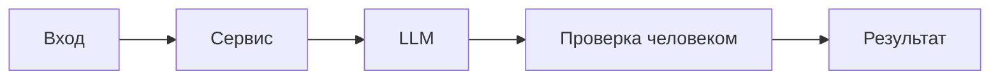

# ADR: решение для первого рабочего сценария

Файл ведёт OpenCode. Обсудите с агентом содержание и проверьте предложенный diff. Все дополнения и исправления поручайте агенту в чате.

- Статус: proposed / accepted
- Дата: 2026-09-14
- Ответственные: команда сервиса code review

## Контекст

Текущая реализация предоставляет POST `/api/reviews`, который передаёт diff во внешний LLM и возвращает `{"comment": answer}`. Проблемы: нет маскировки секретов (SEC-1), нет ограничения длины (API-1), отсутствует таймаут LLM (REL-1), ответ не соответствует OUT-1. \[TRAINING\_PR.diff: app/api.py 35–38; app/review\_service.py 19–22; context.md: SEC-1, API-1, REL-1, OUT-1]

## Решение

Зафиксировать интерфейс и поведение:

- Эндпойнт: `POST /api/reviews` с телом `{ diff: string }`. \[TRAINING\_PR.diff: app/api.py 35–38]
- Валидация: если `len(diff) > 20000`, вернуть HTTP 413. \[context.md: API-1]
- Подготовка входа: до передачи в LLM маскировать секреты (`token=...`, `password=...`, ключи) → `[REDACTED]`. \[context.md: SEC-1]
- Надёжность: оборачивать вызов LLM таймаутом 10 секунд; при срыве возвращать контролируемый ответ. \[context.md: REL-1]
- Формат ответа: OUT-1 — `summary`, массив `risks` (до 3: `file`, `line`, `evidence`, `risk`), массив `checks`. \[context.md: OUT-1]
- Наблюдаемость: логировать только `request_id`, длительность, статус; не логировать diff/ответ. \[context.md: OBS-1]

## Рассмотренные альтернативы

| Альтернатива                            | Почему не выбрали сейчас                                          |
| --------------------------------------- | ----------------------------------------------------------------- |
| Возвращать «как есть» `{comment}`       | Нарушает OUT-1, усложняет проверку и автоматизацию.               |
| Загружать полный diff в LLM без очистки | Риск утечки секретов, нарушает SEC-1.                             |
| Без жёсткого лимита длины               | Риск перегрузки и непредсказуемых задержек, нарушает API-1/REL-1. |

## Последствия и главный риск

- Положительные последствия:
  - Предсказуемый формат ответа; контролируемая деградация при сбоях LLM.
  - Снижение риска утечек за счёт маскировки.
- Ограничения:
  - Ограничение размера входа до 20 000 символов.
  - Возможная потеря контекста из-за маскировки.
- Главный риск:
  - Неверная или неполная маскировка секретов.
- Как проверим риск:
  - Юнит и интеграционные тесты: diff с тестовыми секретами → в prompt только `[REDACTED]`; логов с содержимым нет. \[context.md: SEC-1, OBS-1]

## Архитектурная схема

## Как использовали AI

- Для чего: оформить решение и ограничения по первому сценарию.
- Тип промпта: master-prompt
- Строка в [`prompts.md`](prompts.md): P1-03
- Что проверили и исправили сами: соответствие требованиям contex\[
