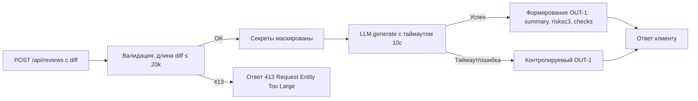

# Анализ процесса: AS IS и TO BE

Файл ведёт OpenCode. Обсудите с агентом содержание и проверьте предложенный diff. Все дополнения и исправления поручайте агенту в чате.

## AS IS

Процесс сейчас:

- Клиент отправляет HTTP POST на эндпойнт `/api/reviews` с полем `diff` в теле запроса. \[TRAINING\_PR.diff: app/api.py 35–38]
- Сервис формирует prompt вида: "Review this pull request and find problems:\n{diff}" и передаёт его во внешний LLM через интерфейс `LLM.generate`. \[TRAINING\_PR.diff: app/review\_service.py 19–22]
- Ответ LLM возвращается пользователю как поле `{ "comment": answer }` без структурирования по OUT-1. \[TRAINING\_PR.diff: app/review\_service.py 21–22]

Участники и компоненты:

- Пользователь/клиент (разработчик) отправляет diff.
- FastAPI-приложение обрабатывает запрос и вызывает `review_service`. \[TRAINING\_PR.diff: app/api.py 35–38]
- Внешний LLM обрабатывает prompt.

Проблемы и риски AS IS:

- Нет маскировки секретов перед отправкой diff во внешний LLM — нарушение SEC-1. Evidence: прямое проксирование diff в prompt. \[TRAINING\_PR.diff: app/review\_service.py 19–21; context.md: SEC-1]
- Нет ограничения длины diff — нарушение API-1 (требуется 413 при > 20 000 символов). \[context.md: API-1]
- Нет таймаута и контролируемой деградации при ошибке LLM — нарушение REL-1 (требуется таймаут 10 с и контролируемый ответ). \[context.md: REL-1]
- Формат ответа не соответствует OUT-1 (ожидаются `summary`, `risks`, `checks`). \[context.md: OUT-1]
- Риск логирования чувствительных данных, если включить подробные логи — требуется соблюдение OBS-1. \[context.md: OBS-1]

## TO BE

Процесс после изменений (соответствие Context Pack):

- Валидация входа: если `diff` > 20 000 символов — HTTP 413. \[context.md: API-1]
- Перед вызовом LLM выполняется маскировка секретов в diff (`[REDACTED]`). \[context.md: SEC-1]
- Вызов LLM обёрнут таймаутом 10 секунд; при таймауте/ошибке — контролируемый ответ. \[context.md: REL-1]
- Ответ сервиса всегда в формате OUT-1: `summary`, `risks` (до 3), `checks`. \[context.md: OUT-1]
- Логи содержат только `request_id`, длительность и статус; содержимое diff/ответа не логируется. \[context.md: OBS-1]

## Разница

| Что меняется        | AS IS                                                                                   | TO BE                               | Как проверим изменение                                                                          |
| ------------------- | --------------------------------------------------------------------------------------- | ----------------------------------- | ----------------------------------------------------------------------------------------------- |
| Формат ответа       | `{ "comment": answer }` \[TRAINING\_PR.diff: app/review\_service.py 21–22]              | OUT-1: `summary`, `risks`, `checks` | Интеграционный тест: POST с валидным diff → схема OUT-1, максимум 3 риска. \[context.md: OUT-1] |
| Маскировка секретов | Отсутствует (diff напрямую в prompt) \[TRAINING\_PR.diff: app/review\_service.py 19–21] | Секреты заменены `[REDACTED]`       | Юнит: diff с `token=abc` → prompt без значения, присутствует `[REDACTED]`. \[context.md: SEC-1] |
| Ограничение длины   | Нет                                                                                     | 413 при > 20 000 символов           | Интеграционный: diff длиной 20001 → HTTP 413. \[context.md: API-1]                              |
| Надёжность LLM      | Нет таймаута                                                                            | Таймаут 10с, контролируемый ответ   | Интеграционный: замокать LLM задержкой >10с → контролируемый OUT-1. \[context.md: REL-1]        |
| Логирование         | Потенциальный риск логирования содержимого                                              | Только метрики и статус             | E2E/обзор логов: нет содержания diff/ответа. \[context.md: OBS-1]                               |

## Как использовали AI

- Для чего: структурирование анализа и формализация TO BE по Context Pack.
- Тип промпта: master-prompt
- Строка в [`prompts.md`](prompts.md): P1-03
- Что проверили и исправили сами: соответствие OUT-1, ссылки на TRAINING\_PR.diff
