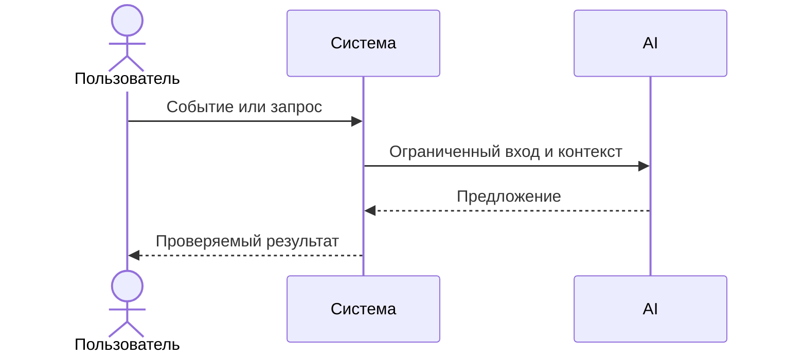

# Use cases и user stories

## Первый рабочий сценарий

Когда разработчик отправляет HTTP POST на `/api/reviews` с полем `diff`, система валидирует размер, маскирует секреты и запрашивает LLM с таймаутом 10с, а пользователь получает структурированный ответ в формате OUT-1. \[TRAINING\_PR.diff: app/api.py 35–38; context.md: API-1, SEC-1, REL-1, OUT-1]

Не входит в этот сценарий:

- Автоматическая правка кода или коммит в репозиторий (SCOPE-1).
- Хранение исходных diff и ответов модели (OBS-1).

## Use case

| Поле               | Значение                                                     |
| ------------------ | ------------------------------------------------------------ |
| Актор              | Разработчик                                                  |
| Триггер            | Отправка POST `/api/reviews` с `diff`                        |
| Предусловия        | Сервис доступен; размер diff ≤ 20 000 символов               |
| Основной результат | JSON по OUT-1: `summary`, `risks`≤3, `checks`                |
| Ошибка или отказ   | 413 при diff > 20 000; контролируемый ответ при таймауте LLM |



## User stories и acceptance criteria

```gherkin
Feature:

  Scenario: Позитивный
    Given сервис доступен и LLM отвечает < 10с
    When я отправляю POST /api/reviews с валидным diff
    Then я получаю JSON по OUT-1 с не более чем 3 рисками и статусом 200

  Scenario: Негативный или граничный
    Given сервис доступен
    When я отправляю POST /api/reviews с diff длиной 20001 символ
    Then я получаю статус 413 Request Entity Too Large
```

## Как использовали AI

- Для чего: формализация сценариев и критериев приёмки.
- Тип промпта: master-prompt
- Строка в [`prompts.md`](prompts.md): P1-03
- Что проверили и исправили сами: соответствие OUT-1/API-1/REL-1 и TRAINING\_PR.diff.
