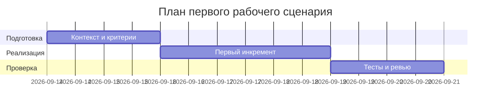

# План поставки

## Инкременты и ответственность

| Инкремент | Наблюдаемый результат              | Что делает человек                  | Что делает AI или субагент                      | Проверка                              | Зависимости                 |
| --------- | ---------------------------------- | ----------------------------------- | ----------------------------------------------- | ------------------------------------- | --------------------------- |
| 1         | Маскировка секретов и OUT-1 формат | Ревью и уточнение правил маскировки | Генерация черновика маскировки и маппинга OUT-1 | Юнит-тесты SEC-1, OUT-1               | \[context.md: SEC-1, OUT-1] |
| 2         | Лимит 20 000 символов и 413        | Подтверждение UX/сообщений ошибок   | Реализация проверки длины в API                 | Интеграционный тест на 20001 симв.    | \[context.md: API-1]        |
| 3         | Таймаут 10с и контролируемый ответ | Имитация отказов LLM                | Обёртка таймаута и fallback                     | Интеграционные тесты с задержкой >10с | \[context.md: REL-1]        |

## Диаграмма Ганта

## Как использовали AI

- Для чего: разбиение сценария на инкременты и проверки
- Тип промпта: master-prompt
- Строка в [`prompts.md`](prompts.md): P1-03
- Что проверили и исправили сами: соответствие с SEC-1/API-1/REL-1/OUT-1, проверяемость результатов.
